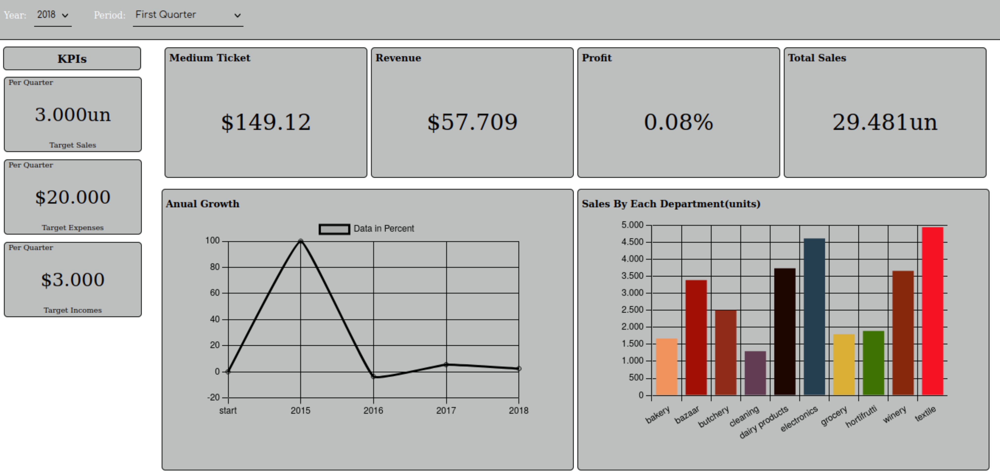
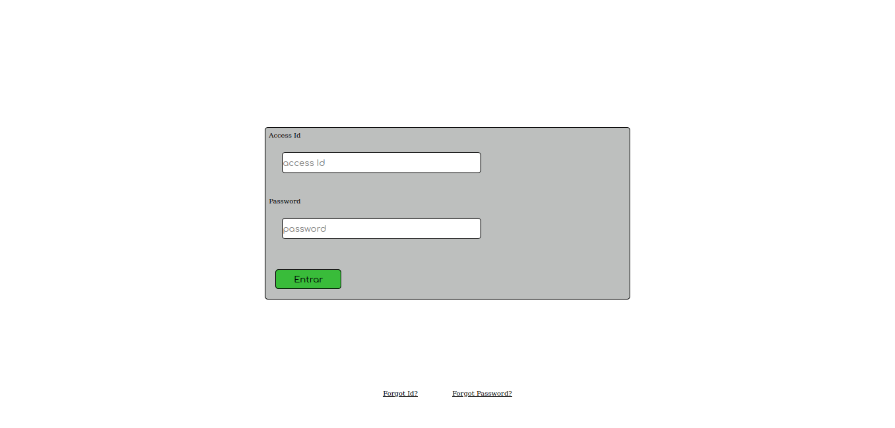

# Market Sales Dashboard

Simple dashboard to track sales and incomes of a market

> For study purposes only

> The layout was intended to work only for desktops, so in other screen sizes could be a differently behavior

    
Screenshots
    
    <h3>Home Panels</h3>
    
    
    <h3>Login Page</h3>
    

## Tecnologies used

| Name           | Desc                      | Version |
|:-------------- |:------------------------- |:-------:|
| Vuejs          | Base                      | 3.2.25  |
| Pinia          | Data Storage              | 2.0.16  |
| Vue Router     | Routing                   | 4.0.13  |
| Chart.js       | Charts                    | 3.8.0   |
| Vite           | Tooling                   | 2.9.9   |
| Vitest         | Test runner               | 0.18.1  |
| Vue Test Utils | Component Testing Library | 2.0.0   |
| Nodejs         | Runtime                   | 16.4.2  |
| NPM            | Package manager           | 8.12.1  |

## Requirements

| Name   | Desc                   | Version |
|:------ |:---------------------- |:-------:|
| Nodejs | Run application        | 16.4.2  |
| NPM    | Manage app dependecies | 8.12.1  |
| NPX    | Run node_modules bin   | 8.12.1  |

> Is some versions of npm the npx comes bundled

## Commands

| Name               | Desc                                         |
| ------------------ | -------------------------------------------- |
| npm run dev        | Run the app in development mode              |
| npm run build      | Generate a optimized build                   |
| npm run preview    | :D                                           |
| npm run test       | Open the vitest in ui mode and run the tests |
| npm run test:cover | Generate code coverage                       |

## A little about

    The app aims to be a sales dahsboard, more specifically a market sales dashboard, with this app you can see total sales, revenue, medium ticket, annual growth and sales from each department with both the sales and the total revenue of that department